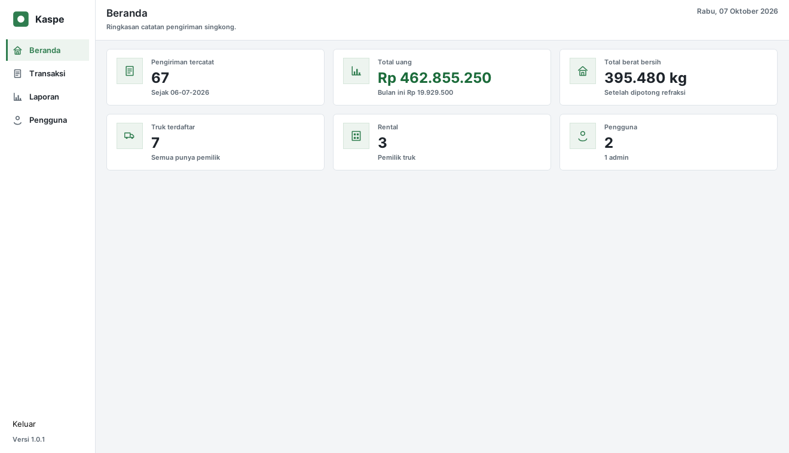

<div align="center">

# Aplikasi Pencatatan Transaksi Kaspe

*Aplikasi desktop Java Swing untuk mencatat pengiriman singkong per truk: menghitung berat bersih setelah potongan refraksi, menghitung jumlah uang yang harus dibayar, dan menyajikan laporan per periode. Dibuat untuk menggantikan pencatatan manual pada buku tulis mitra.*

[Dibutuhkan](#yang-dibutuhkan) • [Mulai cepat](#mulai-cepat) • [Windows](#memasang-di-windows) • [Fitur](#fitur-utama) • [Perhitungan](#aturan-perhitungan) • [NetBeans](#membuka-di-netbeans)

</div>

---

## Tampilan aplikasi



Semua gambar di folder [`preview/`](preview/) diambil dari aplikasi yang benar-benar dijalankan
berikut datanya. Untuk melihat semuanya sekaligus, lihat bagian
[Pratinjau di browser](#pratinjau-di-browser).

---

## Yang dibutuhkan

| Kebutuhan | Keterangan |
|-----------|------------|
| JDK 8 | Target kompilasi `-source 1.8 -target 1.8` (bytecode major 52) |
| NetBeans | Opsional, hanya untuk membuka dan mengubah kode — lihat [Membuka di NetBeans](#membuka-di-netbeans) |

Database **tidak perlu dipasang**. Aplikasi membawa databasenya sendiri (H2), dan tabelnya
dibuat otomatis saat pertama kali dijalankan.

Tiga file jar sudah disertakan di folder `lib/`, tidak perlu diunduh lagi:

- `h2-2.1.214.jar` — database bawaan aplikasi (MPL 2.0)
- `flatlaf-3.7.2.jar` — tema tampilan (Apache License 2.0)
- `flatlaf-fonts-inter-3.19.jar` — huruf Inter (SIL Open Font License 1.1)

> [!NOTE]
> Jar untuk MySQL **tidak** ikut disertakan. Connector/J dari Oracle berlisensi GPLv2, dan
> pengecualian yang membolehkannya dibundel hanya berlaku untuk proyek berlisensi terbuka.
> Kalau kamu perlu mode MySQL, unduh sendiri — caranya di
> [Memakai MySQL](#memakai-mysql-opsional).

> [!NOTE]
> Huruf ikut dikirim bersama aplikasi supaya tampilannya **sama persis di semua komputer**.
> Huruf itu hanya dipakai di Java 8 update **212 ke atas** — di versi yang lebih tua hurufnya
> digambar kebesaran, jadi aplikasi memakai huruf sistem (Segoe UI di Windows, DejaVu di Linux)
> dan lebar kolom bisa sedikit berbeda. Aplikasi tetap jalan di kedua keadaan.
>
> Kalau file huruf itu tidak ada sama sekali, aplikasi juga tetap jalan dengan huruf sistem.

> [!IMPORTANT]
> Aplikasi ini ditulis dan diuji di **Java 8**, jadi itu yang dipakai. Kalau di komputermu
> terpasang JDK lain (misal JDK 21), arahkan `JAVA_HOME` ke folder JDK 8 sebelum menjalankan
> perintah di bawah supaya sama dengan yang sudah diuji.
>
> Seluruh kode memakai API Java 8 atau lebih lama, tanpa satu pun API di atasnya, jadi versi
> 8u berapa pun bisa dipakai. Yang dipakai saat pengujian: Temurin **8u504**.
>
> JDK yang lebih baru juga bisa mengompilasi dan menjalankan aplikasi ini, tetapi belum diuji
> menyeluruh. `build.sh`, `test.sh`, dan `compile.bat` mematok hasil kompilasi ke bytecode
> Java 8, jadi hasilnya tetap bisa dibuka di komputer ber-JDK 8.

---

## Mulai cepat

### 1. Jalankan

**Linux / macOS**

```bash
export JAVA_HOME=/path/ke/jdk1.8.0_171
./build.sh
./run.sh
```

**Windows** — klik dua kali `compile.bat`, lalu `run-app.bat`. Kedua berkas itu memakai
`JAVA_HOME` yang sudah ada di Windows; kalau belum ada, keduanya berhenti sambil memberi tahu.

Kalau ini pertama kalinya di komputermu, ikuti [Memasang di Windows](#memasang-di-windows) — di
situ langkahnya lengkap, mulai dari memasang JDK 8-nya.

Saat pertama kali dijalankan, aplikasi membuat sendiri database beserta seluruh tabelnya —
tidak ada langkah persiapan. Yang terbuka lebih dulu adalah layar masuk: pada pemakaian
pertama, layar yang sama sekalian menjadi pembuat akun admin pertama (nama, sandi, dan
ulangi sandinya); setelah itu, setiap kali dibuka, aplikasi meminta nama pengguna dan sandi
sebelum halaman pembukanya terbuka.

### 2. Letak data dan cara mencadangkan

Data disimpan sebagai satu file di folder pengguna:

| Sistem | Letak file |
|--------|------------|
| Windows | `C:\Users\<nama kamu>\kaspe\db_kaspe.mv.db` |
| Linux / macOS | `~/kaspe/db_kaspe.mv.db` |

**Cara mencadangkan yang benar:** di halaman **Transaksi**, pada kartu "Transaksi Tersimpan",
tekan **Cadangkan Database** di ujung kanan baris tombolnya (baris yang memuat "Ubah" dan
"Hapus"). Aplikasi membuat satu berkas `.zip` bertanggal di folder
`cadangan` di sebelah file database, dan jalur lengkapnya diberitahukan setelah selesai.
Cara ini memakai fasilitas cadangan bawaan H2, jadi isinya tetap utuh walau aplikasi
sedang dipakai — dan cadangan kedua tidak menimpa yang pertama.

Menyalin file `db_kaspe.mv.db` sendiri juga bisa, **tetapi aplikasinya harus ditutup dulu**.
Selama aplikasi terbuka, file itu sedang ditulis, sehingga salinannya bisa setengah jadi
dan justru tidak bisa dibuka — cadangan yang rusak lebih berbahaya daripada tidak punya
cadangan, karena terlihat seperti cadangan yang sah.

Untuk memulihkan: tutup aplikasi, lalu ganti file database dengan isi cadangan.

**Catatan untuk pemakaian MySQL/MariaDB:** pencadangan otomatis di aplikasi ini hanya
berlaku untuk database bawaan (H2). Kalau memakai MySQL, cadangannya urusan pengelola
server database, dan tombol itu akan mengatakan hal itu terus terang.

---

## Memasang di Windows

Aplikasi ini tidak punya program pemasang (installer). Cara memasangnya cukup **salin
foldernya** ke komputer, lalu jalankan dua berkas `.bat` yang sudah tersedia. Yang benar-benar
perlu dipasang hanya **JDK 8**.

Bagian ini untuk pemasangan dari nol. Kalau JDK 8 sudah ada dan `compile.bat` sudah pernah
berhasil, langsung ke langkah 4.

> [!NOTE]
> Kedua berkas `.bat` di bagian ini **belum pernah dijalankan di Windows** saat rilis ini
> dibuat — pengembangannya berjalan di Linux. Isinya memakai pola perintah Windows yang lazim,
> dan setiap kegagalan sudah diberi pesan yang jelas (lihat [Kalau gagal](#6-kalau-gagal)).
> Kalau ada yang meleset di komputermu, laporkan pesan galatnya lewat Issues.

### 1. Pasang JDK 8

Aplikasi ini ditulis dan diuji di **JDK 8**, jadi itu yang perlu dipasang. JDK yang lebih baru
(11, 17, 21, 25) juga bisa, tetapi belum diuji menyeluruh — JDK 8 tetap yang jadi acuan.

1. Buka halaman unduhan Temurin 8:
   <https://adoptium.net/temurin/releases/?version=8&os=windows>
2. Pilih **Architecture: x64**, **Package Type: JDK**, lalu unduh berkas `.msi`-nya. Nama
   berkasnya seperti `OpenJDK8U-jdk_x64_windows_hotspot_8u504b01.msi`, ukurannya sekitar 100 MB.
3. Buka berkas `.msi` itu dan setujui lisensinya.
4. Di layar **Custom Setup**, perhatikan dua hal:
   - Biarkan **Add the installation to the PATH environment variable** tetap tercentang.
   - Klik ikon di sebelah kiri pohon pilihannya untuk membuka pilihan tambahan, lalu centang
     **Set JAVA_HOME variable**.
5. Klik **Next**, lalu **Install**, lalu **Finish**.

Bawaannya JDK terpasang di `C:\Program Files\Eclipse Adoptium\`, di dalam satu folder yang
namanya memuat versi JDK-nya (misalnya `jdk-8.0.504.302-hotspot`). **Buka folder itu dan
catat namanya** — dipakai di langkah 3.

**Cara memeriksa pemasangannya benar.** Tekan `Win+R`, tulis `cmd`, tekan Enter, lalu tulis:

```
java -version
```

Yang benar keluar seperti ini — perhatikan angkanya diawali `1.8`:

```
openjdk version "1.8.0_504"
OpenJDK Runtime Environment (Temurin)(build 1.8.0_504-b01)
OpenJDK 64-Bit Server VM (Temurin)(build 25.504-b01, mixed mode)
```

> [!IMPORTANT]
> Kalau yang keluar `'java' is not recognized`, JDK 8 belum terpasang — ulangi langkah 1.
>
> Kalau yang keluar versi lain (11/17/21), aplikasi kemungkinan besar tetap jalan, tetapi versi
> itu belum diuji menyeluruh. Paling aman tetap pasang JDK 8.

### 2. Taruh folder aplikasi

Salin seluruh folder aplikasi ke komputer, misalnya ke `C:\kaspe-app` atau ke Desktop.

> [!WARNING]
> Jangan ditaruh di dalam `C:\Program Files`. Windows melindungi folder itu, sehingga
> `compile.bat` akan gagal membuat folder `build` di situ.

### 3. Pastikan JAVA_HOME sudah menunjuk ke JDK 8

Kalau saat memasang tadi kamu mencentang **Set JAVA_HOME variable** (langkah 1), bagian ini
biasanya **tidak perlu dikerjakan** — kedua berkas `.bat` memakai setelan itu apa adanya.

Untuk memeriksanya, tekan `Win+R`, tulis `cmd`, tekan Enter, lalu tulis:

```
echo %JAVA_HOME%
```

Kalau yang keluar alamat folder JDK 8-mu, langsung ke langkah 4. Kalau yang keluar kosong atau
alamat JDK lain, sunting kedua berkas `.bat`:

1. Klik kanan `compile.bat` → **Edit**. (Kalau tidak ada menu itu, pilih **Open with** →
   **Notepad**.)
2. Cari baris `if not defined JAVA_HOME set JAVA_HOME=...` di bagian atas, lalu ganti alamatnya
   dengan alamat JDK 8-mu — nama folder yang kamu catat di langkah 1:

   ```
   if not defined JAVA_HOME set JAVA_HOME=C:\Program Files\Eclipse Adoptium\jdk-8.0.504.302-hotspot
   ```

3. Simpan, lalu lakukan hal yang sama pada `run-app.bat`.

Jangan memakai tanda kutip dan jangan mengakhiri alamat dengan garis miring (`\`). Baris itu
hanya dipakai kalau `JAVA_HOME` belum ada, jadi setelan Windows-mu tidak akan tertimpa.

### 4. Kompilasi

Klik dua kali `compile.bat`. Jendela hitam akan terbuka, bekerja sebentar, lalu berhenti di
salah satu dari dua tulisan ini:

| Tulisan terakhir | Artinya |
|---|---|
| `Selesai. Class ada di build\` | Berhasil — folder `build/` sudah terbentuk |
| `Kompilasi GAGAL.` | Ada yang salah; pesan galatnya ada di baris-baris di atasnya |

Tekan tombol apa saja untuk menutup jendelanya.

Kalau jendelanya menutup sebelum kamu sempat membaca pesannya, jalankan dari Command Prompt
supaya pesannya tetap terlihat:

```
cd /d C:\kaspe-app
compile.bat
```

### 5. Jalankan

Klik dua kali `run-app.bat`. Jendela aplikasi terbuka di layar masuk; setelah berhasil masuk,
halaman pembuka terbuka.

Langkah 4 **tidak perlu diulang setiap hari** — `compile.bat` hanya perlu dijalankan lagi kalau
kodenya diubah. Untuk pemakaian sehari-hari, cukup klik `run-app.bat`.

Cara mencadangkan data ada di [Letak data dan cara mencadangkan](#2-letak-data-dan-cara-mencadangkan).

### 6. Kalau gagal

| Yang terlihat | Sebabnya | Perbaikannya |
|---|---|---|
| `JAVA_HOME salah atau belum diisi: "..."` | Windows belum punya `JAVA_HOME`, atau isinya bukan JDK 8 | Ulangi langkah 3 |
| `Kompilasi GAGAL.` | Kodenya gagal dikompilasi | Baca pesan galat di baris-baris atasnya |
| `Aplikasi belum dikompilasi.` | `run-app.bat` diklik padahal `compile.bat` belum pernah berhasil | Jalankan `compile.bat` dulu — langkah 4 |
| `Access is denied.` | Folder aplikasi ada di dalam `C:\Program Files` | Pindahkan ke folder lain — langkah 2 |
| `UnsupportedClassVersionError: ... class file version 65.0` | Folder `build/` dibuat oleh JDK yang lebih baru, misalnya hasil salinan dari komputer lain | Hapus folder `build/`, lalu jalankan `compile.bat` lagi — langkah 4 |
| Tulisan di aplikasi kebesaran | JDK 8-nya lebih tua dari update 212 | Pasang JDK 8 update 212 ke atas — 8u504 sudah aman |
| "Aplikasi sepertinya sudah terbuka di jendela lain." | Aplikasi sedang terbuka di jendela lain | Tutup dulu jendela yang itu, lalu jalankan lagi |
| "Aplikasi tidak bisa menulis file datanya di: ..." | Folder datanya tidak bisa ditulis | Ikuti pesan yang muncul, atau ubah `db.url` lewat berkas `kaspe.properties` |

---

## Memakai MySQL (opsional)

Bawaan aplikasi sudah cukup untuk pemakaian satu komputer. MySQL diperlukan hanya kalau
datanya mau dipakai bersama oleh beberapa komputer sekaligus — karena H2 menyimpan datanya
sebagai file, dan satu file hanya bisa dibuka satu aplikasi.

**Langkah tambahan: unduh Connector/J.** Berkasnya tidak ikut disertakan (lihat catatan di
[Yang dibutuhkan](#yang-dibutuhkan)). Ambil dari <https://dev.mysql.com/downloads/connector/j/>,
pilih **Platform Independent**, lalu taruh berkas `.jar`-nya di folder `lib/`. Aplikasi mencari
driver itu berdasarkan nama saat dijalankan, jadi tidak ada yang perlu diubah lagi — kecuali
kalau kamu memakai NetBeans, yang perlu diberi tahu lewat klik kanan proyek → **Properties** →
**Libraries** → **Add JAR/Folder**.

Nyalakan MySQL, lalu buat file bernama `kaspe.properties` **di folder yang sama dengan
aplikasi**, berisi:

```properties
db.driver=com.mysql.cj.jdbc.Driver
db.url=jdbc:mysql://localhost:3306/db_kaspe?serverTimezone=Asia/Jakarta
db.user=root
db.password=ISI_PASSWORD_MYSQL_KAMU
```

File itu akan dipakai menggantikan pengaturan bawaan, jadi aplikasi hasil build tidak perlu
dibongkar atau dibangun ulang. Kalau kamu mengerjakan dari folder proyek, salin saja
`src/kaspe.properties` lalu aktifkan bagian MySQL di dalamnya.

Database dan tabelnya dibuat sendiri oleh aplikasi — tidak perlu menjalankan skrip apa pun,
cukup nyalakan server MySQL-nya.

---

## Fitur utama

- **Masuk dengan akun dan peran** — aplikasi terbuka di layar masuk; pemakaian pertama
  sekalian membuat akun admin pertama (nama, sandi, ulangi sandi; sandi minimal 4 karakter).
  Ada dua peran: **Admin** boleh mengelola akun di halaman Pengguna (tambah, ubah nama, peran,
  atau sandi, hapus), sedangkan peran **Pengguna** mencatat transaksi dan melihat laporan
  tanpa melihat halaman itu — bilah sisinya pun tidak memuat entri Pengguna. Sandi tidak
  disimpan apa adanya, melainkan sebagai hasil penyandian PBKDF2 dengan garam sendiri per
  akun. Gagal masuk selalu memunculkan satu pesan yang sama ("Nama atau sandi salah.") supaya
  tidak ketahuan nama mana yang tercatat. Admin terakhir tidak bisa dihapus, begitu pula
  akun yang sedang dipakai, dan admin terakhir tidak bisa diturunkan menjadi pengguna
  biasa — tanpa penolakan itu bisa habis adminnya, halaman Pengguna tak bisa dibuka lagi
  dari dalam aplikasi, dan buku catatan mengunci dirinya sendiri.
- **Halaman pembuka** — empat kartu ringkasan: jumlah pengiriman, total uang (beserta uang
  bulan berjalan), total berat bersih, dan truk terdaftar.
- **Satu pengiriman, satu catatan** — mengisi form lalu menekan Simpan langsung menulis ke
  buku catatan. Tidak ada penampungan sementara dan tidak ada istilah "baris": dua pengiriman
  truk yang sama pada tanggal yang sama tetap tercatat sebagai dua catatan terpisah.
- **Perhitungan otomatis** — berat bersih dan jumlah uang terhitung sambil kamu mengetik, tanpa
  menekan tombol apa pun. Keduanya tampil di kanan form, tepat di atas tombol Simpan, jadi angka
  yang dibaca sebelum menyimpan dan tombol yang ditekan sesudahnya berdampingan. Isian formnya
  tersusun dua baris dengan tepi kiri yang lurus dari atas ke bawah.
- **Ubah dan hapus** — daftar Transaksi Tersimpan menampilkan setiap pengiriman (tanggal, plat,
  rental, bobot, dan jumlah uang). Pilih satu baris lalu Ubah untuk memperbaikinya, atau pilih
  satu baris atau lebih lalu Hapus. Penghapusan sekaligus bersifat tuntas: kalau satu catatan
  gagal terhapus, tidak ada satu pun yang terhapus.
- **Saringan daftar** — daftar Transaksi Tersimpan bisa disaring menurut rentang tanggal,
  nama rental, dan sepenggal plat. Rentang tanggal disaring oleh database; rental dan plat
  dicocokkan memakai aturan penyeragaman yang sama dengan bagian aplikasi lain, sehingga
  plat ber-ejaan lama pun tetap ketemu. Kolom "Jumlah Uang" di tabel selalu menunjukkan uang
  per baris, jadi angka yang terlihat selalu milik baris yang terlihat. Tombol "Semua"
  mengembalikannya ke seluruh rentang.
- **Belum dibayar** — centang "Sudah dibayar" dilepas membuat baris tercatat dengan tanggal
  lunas kosong (belum dibayar), bukan dipaksa lunas hari itu.
- **Isian dijaga** — pindah halaman atau menutup jendela saat form masih terisi ditanya dulu,
  jadi ketikan yang belum disimpan tidak hilang diam-diam.
- **Data master** — dialog "Kelola Data Truk" (dibuka lewat tombol "Kelola" di sebelah
  kotak "Plat / Truk" pada halaman Transaksi): satu tabel semua
  truk beserta pemiliknya dan satu baris isian. Pemilik wajib dipilih — kotaknya sengaja
  kosong, tidak ada pemilik bawaan — jadi truk tidak bisa tercatat milik orang yang salah.
  Menambah langsung tersimpan; mengubah lewat tombol "Ubah"; "Hapus" bisa beberapa truk
  sekaligus (semua diperiksa dulu, satu pun yang masih terpakai membatalkan semuanya); dan
  truk yang salah pemilik dipindahkan lewat tombol Pindah Pemilik, tanpa perlu dihapus dan
  dicatat ulang. Nama pemilik diganti atau pemilik dihapus lewat tombol "Kelola Pemilik...".
- **Riwayat lama dijaga** — truk yang sudah dipakai catatan pengiriman tidak bisa dihapus,
  begitu juga rental yang masih punya truk. Menghapusnya akan menghilangkan plat dan
  pemiliknya dari catatan yang sudah ada, termasuk laporan yang sudah dicetak, dan itu
  tidak bisa dikembalikan. Penolakannya menyebut jumlah catatan yang terdampak beserta
  jalan keluarnya.
- **Laporan** — filter rentang tanggal, rental, dan sepenggal plat; tabel rinci per baris,
  total berat bersih dan total uang, serta cetak. Saringan yang sedang dipakai ikut tertulis
  di kaki halaman yang dicetak, jadi kertasnya menyebut sendiri periode dan rental apa yang
  dicakupnya. Judul kolom bisa diklik untuk mengurutkan — kolom uang dan bobot diurut menurut
  nilainya, bukan menurut tulisannya, jadi Rp 10.000.000 memang di atas Rp 6.888.500. Nama
  rental dan plat diurut dengan aturan abjad tetap, bukan aturan bahasa komputer, supaya hasil
  di dua komputer tidak berbeda. Ada tombol **Hari ini / Bulan ini / Semua** untuk mempersempit
  rentang dengan satu klik, dan **Rekap per rental** yang menjumlahkan baris yang sedang tampil
  per pemilik truk.
- **Ekspor CSV** — tombol di baris total menuliskan baris yang sedang tampil ke berkas yang bisa
  dibuka di Excel. Angkanya polos tanpa titik pemisah ribuan supaya langsung bisa dijumlahkan,
  dan pemisah kolomnya titik koma karena Excel berbahasa Indonesia memakai koma sebagai pemisah
  desimal. Berkasnya menyebut sendiri periode, saringan, dan urutan yang sedang berlaku —
  namanya memakai periode laporan, tetapi bisa diganti orang, dan berkas laporan sebagian yang
  tidak menyebut bagiannya tidak bisa dibedakan dari daftar lengkap. Berisi satu kolom yang
  tidak ada di layar: **susut** (bobot lapak dikurangi bobot pabrik). Kolom itu tidak muat di
  tabel layar — menambahnya membuat jendela terkecil harus lebih lebar daripada jendela bawaan —
  sedangkan di berkas tidak ada batas lebar. Berkas yang sudah ada ditanyakan dulu sebelum
  ditimpa, karena jendela "simpan berkas" bawaan Java tidak menanyakannya sendiri.
- **Cadangkan database** — tombol di ujung kanan baris tombol kartu "Transaksi Tersimpan"
  (halaman Transaksi) membuat berkas cadangan bertanggal
  dari database bawaan (H2), memakai fasilitas cadangan H2 sendiri sehingga isinya konsisten
  walau aplikasi sedang dipakai. Cadangan kedua tidak menimpa yang pertama. Pada MySQL/MariaDB
  tombolnya mengatakan terus terang bahwa pencadangan otomatis hanya berlaku untuk database
  bawaan aplikasi.
- **Setelan yang rusak tidak diam-diam dipakai** — kalau berkas `kaspe.properties` ada tetapi
  tidak memuat letak database, aplikasi menolak dibuka dan menjelaskan berkas mana yang
  bermasalah serta dua jalan keluarnya. Aplikasi tidak pernah diam-diam memakai database lain.
- **Pratinjau cetak** — laporan diperiksa di layar dulu sebelum kertas dipakai, jadi kelihatan
  berapa halaman dan di mana halamannya terpotong.
- **Tampilan seragam** — memakai tema FlatLaf, jadi bentuk jendela sama di Windows maupun Linux,
  tidak ikut berganti mengikuti sistem operasi.

> [!IMPORTANT]
> Sandi tidak bisa dipulihkan dari dalam aplikasi. Kalau satu-satunya admin lupa sandinya,
> tidak ada jalan masuk yang bisa dibuka lewat aplikasi — akun itu harus dibereskan langsung
> di database-nya. Karena itu catat sandi admin di tempat yang aman. Untuk berganti akun,
> tombol **Keluar** di kaki bilah samping mengakhiri sesi dan kembali ke layar masuk; kalau
> ada isian transaksi yang belum disimpan, ditanya dulu. Menutup jendela aplikasi (X)
> mengakhiri aplikasi seluruhnya.

---

## Aturan perhitungan

```
berat_bersih = FLOOR((bobot_pabrik x (1 - refraksi/100)) / 5) x 5
jumlah_uang  = berat_bersih x harga
susut        = bobot_lapak - bobot_pabrik     (hanya untuk pemantauan)
```

Bobot lapak dicatat sebagai pembanding saja, tidak dipakai menghitung uang. Refraksi dan harga
disimpan per baris karena nilainya berbeda-beda setiap transaksi.

Contoh nyata dari buku mitra:

```
bobot_pabrik 7050 kg, refraksi 15%, harga Rp 1.150/kg
  7050 x 0,85 = 5992,5  →  dibulatkan ke bawah ke kelipatan 5  →  5990 kg
  5990 x 1150 = Rp 6.888.500
```

Rumus ini sudah dicocokkan dengan 4 baris buku asli, hasilnya sama semua.

---

## Membuka di NetBeans

Folder ini sudah berupa proyek NetBeans (Java with Ant), jadi tidak perlu dibuat dari nol.

> [!NOTE]
> NetBeans di sini **hanya untuk membuka dan mengubah kode**. Untuk sekadar memakai aplikasinya,
> NetBeans tidak perlu dipasang — cukup ikuti [Memasang di Windows](#memasang-di-windows).

Yang wajib adalah **JDK 8**, bukan versi NetBeans-nya. NetBeans terbaru berjalan di atas JDK 17
atau lebih baru, sedangkan kode ini dikompilasi dengan JDK 8; keduanya bisa dipakai bersamaan
asalkan JDK 8 didaftarkan sebagai *Java Platform* di dalam NetBeans (langkah 3).

> [!IMPORTANT]
> **NetBeans 8.0.2 dari tahun 2014 sudah tidak punya sumber unduhan resmi.** Halaman arsip
> Apache menyatakan versi sebelum Apache tidak lagi bisa diunduh dari mana pun, sehingga berkas
> NetBeans 8.0.2 yang beredar hanya ada di situs tidak resmi — sebaiknya jangan diunduh.
> Kalau kamu memang sudah punya NetBeans 8.0.2, langkah di bawah tetap sama.

### 1. Pasang NetBeans

Unduh dari <https://netbeans.apache.org/front/main/download/> lalu pasang seperti biasa.
Bawaannya NetBeans meminta JDK 17 atau lebih baru saat dipasang — itu tidak masalah, JDK 8
menyusul di langkah 3.

Kalau komputermu hanya punya JDK 8 dan tidak bisa memasang JDK 17 (misalnya karena tidak punya
hak admin), pakai NetBeans versi lama. Halaman resmi Apache menyatakan rilis **12.5** dan
sebelumnya bisa dijalankan dengan JDK 8, sedangkan mulai 12.6 NetBeans mewajibkan JDK 11.
Pemasang 12.5 masih tersimpan di arsip resmi Apache, sekitar 411 MB:

<https://archive.apache.org/dist/netbeans/netbeans/12.5/Apache-NetBeans-12.5-bin-windows-x64.exe>

NetBeans 11.3 juga jalan di JDK 8 dan unduhannya lebih kecil, sekitar 194 MB:
<https://archive.apache.org/dist/netbeans/netbeans/11.3/Apache-NetBeans-11.3-bin-windows-x64.exe>

### 2. Buka proyeknya

**File → Open Project**, arahkan ke folder aplikasi ini, lalu klik **Open Project**. NetBeans
mengenalinya sebagai proyek **Java with Ant**.

### 3. Daftarkan JDK 8

Proyek ini diatur memakai JDK 8, jadi JDK 8 perlu dikenalkan dulu ke NetBeans.

1. **Tools → Java Platforms → Add Platform...**
2. Pilih **Java Standard Edition**, klik **Next**.
3. Isi **Platform Folder** dengan folder JDK 8-mu
   (`C:\Program Files\Eclipse Adoptium\jdk-8.0.504.302-hotspot`), klik **Next**, lalu **Finish**.
4. Klik kanan nama proyek di panel **Projects** → **Properties**:
   - **Sources** → **Source/Binary Format**: pilih **JDK 8**
   - **Libraries** → **Java Platform**: pilih JDK 8 yang baru didaftarkan

Nama menunya bisa sedikit berbeda tergantung versi NetBeans. Kalau JDK 8 tidak muncul di daftar
Java Platform, berarti langkah 3 di atas belum berhasil.

### 4. Jalankan

Tekan **F6** (Run Project). Kelas utamanya sudah diatur ke `kaspe.Main`, jadi tidak ada yang
perlu diisi lagi.

### 5. Buat berkas siap pakai

Tekan **Shift+F11** (Clean and Build). Yang seharusnya dihasilkan:

```
dist/
  KaspeApp.jar
  lib/             jar pendukung
```

> [!WARNING]
> **Langkah ini belum pernah dicoba di Windows**, dan ada satu bagian yang bisa meleset:
> pembuatan folder `dist/lib/` diserahkan ke NetBeans, sedangkan catatan yang dibutuhkannya
> (`libs.CopyLibs.classpath`) tidak ada di dalam folder `nbproject/` pada repo ini — biasanya
> NetBeans membuatnya sendiri saat proyek dibuka. Kalau `dist/lib/` ternyata tidak terbentuk,
> **salin saja folder `lib/` dari folder proyek** ke dalam `dist/`. Hasilnya sama.
>
> Kalau tidak mau menebak-nebak, pakai jalur `compile.bat` + `run-app.bat` saja — caranya ada di
> [Memasang di Windows](#memasang-di-windows).

`KaspeApp.jar` hanya bisa diklik dua kali kalau ada folder `lib/` di sebelahnya: di dalam jar-nya
sudah tertulis bahwa pustakanya dicari di situ. Jadi kalau berkas ini mau dipindahkan ke komputer
lain, **salin seluruh folder `dist/`**, bukan hanya jar-nya.

> [!NOTE]
> Kalau `nbproject/build-impl.xml` dianggap tidak cocok dengan versi NetBeans-mu, NetBeans akan
> membuat ulang berkas itu sendiri — biarkan saja.

---

## Pratinjau di browser

Folder [`preview/`](preview/) berisi halaman pratinjau statis — tidak butuh JDK, MySQL, maupun
NetBeans untuk melihatnya. Semua gambar sudah disematkan ke dalam satu file, jadi:

- **Buka langsung**: klik dua kali `preview/index.html`, atau
- **Lewat server lokal** (kalau browser kamu tidak mengizinkan file lokal):

```bash
python3 -m http.server 8000 --directory preview
```

Lalu buka `http://localhost:8000` di browser.

### Urutan pembuatannya penting

Gambar PNG-nya dibuat lebih dulu, dengan menyusun ulang tampilan aplikasi:

```bash
./build.sh
javac -cp "build:lib/*" -d /tmp/tools tools/BuatPratinjau.java
java -Djava.awt.headless=true -cp "build:lib/*:/tmp/tools" BuatPratinjau
```

Program itu memasang data contoh dari `docs/data-contoh.sql`, menyusun bilah samping, bilah nama
halaman, dan isinya memakai susunan yang sama dengan jendela aplikasi, lalu menggambar
hasilnya ke `preview/*.png`. Jadi gambarnya sama dengan aplikasi yang dijalankan. Dialog
Kelola Data Truk digambar sebagai panelnya — tanpa membuka jendela dialog, karena pembuatnya
berjalan tanpa layar.

**Baru sesudah itu** halaman `index.html` dibuat ulang dari gambar-gambar tersebut:

```bash
python3 preview/build-preview.py
```

Urutannya tidak boleh dibalik: `index.html` menyimpan gambarnya sebagai teks di dalam berkasnya
(base64), jadi halaman itu memuat gambar apa adanya **saat ia dibuat**. Kalau ia dibuat sebelum
gambarnya digambar ulang, halaman itu tetap memuat gambar yang lama sementara berkas PNG di
sebelahnya sudah baru - dan yang terlihat di browser bukan yang terakhir kamu ubah. Kalau
gambarnya tidak berubah, membuat ulang halamannya saja sudah cukup.

> [!NOTE]
> Pembuat pratinjau berjalan tanpa layar (`-Djava.awt.headless=true`), jadi bisa dijalankan
> di server tanpa tampilan maupun tetikus.

> [!NOTE]
> Ini pratinjau statis, bukan aplikasi yang bisa diklik; untuk mencoba aplikasinya sendiri,
> ikuti bagian [Mulai cepat](#mulai-cepat).

---

## Data contoh

`docs/data-contoh.sql` berisi 64 pengiriman (satu catatan per pengiriman) dari Juli sampai
September 2026 — dipakai untuk
demo dan untuk membuat gambar pratinjau. Semua angkanya mengikuti rumus yang sama dengan aplikasi.

**Memakainya.** Jalankan aplikasi sekali supaya tabelnya terbentuk (database H2 dibuat sendiri
saat pertama dibuka), lalu tutup aplikasi dan jalankan:

```bash
java -cp lib/h2-2.1.214.jar org.h2.tools.RunScript \
  -url "jdbc:h2:~/kaspe/db_kaspe;MODE=MySQL;DATABASE_TO_LOWER=TRUE" \
  -user sa -password "" -script docs/data-contoh.sql
```

Buka aplikasi lagi — 64 pengiriman itu sudah ada. Berkas ini **mengganti** seluruh isi database
(diawali `DELETE`), jadi jangan dipakai pada database yang sudah berisi data penting.

> [!NOTE]
> Menu **Laporan** terbuka dengan filter yang sudah mencakup seluruh data, jadi datanya langsung
> terlihat. Kalau mau menyaring sendiri, ubah tanggal **Dari** dan **Sampai** lalu tekan
> **Tampilkan**.

### Membuat ulang dan memeriksa

Berkas data contoh dibuat oleh `tools/BuatDataContoh.java`, dan angkanya bisa diperiksa ulang
dengan `tools/PeriksaDataContoh.java`. Keduanya memakai `Calculator` yang sama dengan aplikasi,
jadi angkanya tidak bisa melenceng kalau aturan pembulatan berubah:

```bash
./build.sh

# membuat ulang berkas data contoh
javac -cp build -d /tmp/tools tools/BuatDataContoh.java
java -cp "build:/tmp/tools" BuatDataContoh docs/data-contoh.sql

# memeriksa angkanya terhadap rumus aplikasi
javac -cp "build:lib/*" -d /tmp/tools tools/PeriksaDataContoh.java
java -cp "build:lib/*:/tmp/tools" PeriksaDataContoh
```

Hasil pemeriksaan yang benar:

```
pengiriman      = 64
baris diperiksa = 64
selisih berat   = 0
selisih uang    = 0
HASIL: cocok dengan rumus aplikasi
```

Pemeriksa yang sama bisa dipakai untuk database yang sudah ada, dengan menyebutkan foldernya
sebagai argumen kedua — berguna untuk memeriksa hasil render pratinjau (67 transaksi, 67 baris):

```bash
java -cp "build:lib/*:/tmp/tools" PeriksaDataContoh "" /tmp/kaspe-pratinjau
```

---

## Memeriksa data sendiri

`tools/PeriksaData.java` memeriksa database yang sedang kamu pakai dan melaporkan apakah ada
tanda kerusakan: truk yang kehilangan pemiliknya, baris lama yang kehilangan plat truknya,
catatan tanggal yang tidak berisi baris apa pun, dan nama rental yang tertulis dua kali dengan
besar-kecil huruf berbeda.

**Alat ini tidak mengubah apa pun.** Ia tidak menambah, mengubah, atau menghapus data, dan
tidak membuat tabel. Kalau berkas databasenya belum ada, ia berhenti dan mengatakannya —
tidak membuat database kosong.

Kalau berkas setelannya rusak, alat ini **menolak jalan** dan menyebut berkasnya, sama seperti
aplikasinya (lihat "Kalau aplikasi tidak mau dibuka"). Alat ini memeriksa buku catatan
sungguhan, jadi menjawab "aman" untuk database yang keliru lebih berbahaya daripada tidak
menjawab.

Jalankan dari folder aplikasi, setelah `./build.sh`:

```bash
javac -cp "build:lib/*" -d /tmp/tools tools/PeriksaData.java
java -cp "build:lib/*:/tmp/tools" PeriksaData
```

Baris pertama keluarannya menyebut database mana yang diperiksa. Periksa dulu alamat itu
sebelum mempercayai hasilnya — kalau alamatnya bukan database yang biasa kamu pakai, hasilnya
tidak berarti apa-apa.

Kalau aplikasinya sedang terbuka, tutup dulu: database H2 hanya boleh dibuka satu program
sekaligus. Tanpa berkas `mysql-connector-j` di folder `lib/`, alat ini hanya bisa memeriksa
mode H2 (bawaan).

Bagian 1 dan 2 keluarannya adalah **catatan, bukan masalah**: pemilik atau truk yang baru
didaftarkan dan memang belum pernah mengirim itu wajar, dan tidak perlu dihapus.

---

## Uji otomatis

```bash
export JAVA_HOME=/path/ke/jdk1.8.0_171
./test.sh
```

Uji memakai database H2 di memori, jadi tidak menyentuh data asli milikmu dan tidak butuh
pemasangan apa pun.

| Berkas uji | Cakupan | Hasil |
|------------|---------|-------|
| `TestCalculator` | rumus berat bersih, jumlah uang, susut, satuan bobot/refraksi, validasi | 8 lulus |
| `TestDatabase` | pembuatan tabel otomatis (termasuk tabel pengguna), skema, view, foreign key, pembersihan kolom lama (nomor nota, view lama ikut diuji), perapian database lama jadi satu catatan per pengiriman (jumlah dan total uang tidak berubah, waktu pencatatan asli ikut pindah, aman diulang) | 57 lulus |
| `TestDao` | master, plat diketik langsung (termasuk ejaan lama), ganti pemilik truk, tambah rental tidak menimpa rental lama, nama/plat kembar ditolak, simpan transaksi, rollback, laporan, rekap, hapus, ubah pengiriman, hapus sekaligus yang tuntas, daftar pengiriman terbaru dulu, saringan tanggal/rental/plat (rental dicocok persis dan tanpa beda huruf besar-kecil, plat sebagian termasuk ejaan lama berspasi berlebih, hasilnya sama dengan jumlah di database), penghapusan truk/rental yang beriwayat ditolak dan riwayatnya tetap utuh, cadangan database ditolak di luar H2 dengan pesan yang jelas, cadangan sungguhan pada H2 berbasis berkas (zip terisi, tidak menimpa), akun pengguna (masuk dengan sandi benar/salah, garam berbeda menghasilkan hasil sandi berbeda, ubah nama/peran/sandi, ganti sandi tanpa menimpa yang lama, hapus) | 111 lulus |
| `TestUi` | panel tampilan tergambar, bilah halaman, huruf, pratinjau cetak, lebar kolom tabel, tinggi daftar pengiriman tersimpan, jumlah baris laporan ikut terisi, kaki cetak menyebut saringan rental/plat, tombol rentang cepat memasang rentangnya, nilai susut di berkas CSV, tombol tidak terpotong wadahnya, kolom tabel utuh dan halaman muat tanpa digulir pada ukuran jendela minimum, perataan judul kolom mengikuti isinya, tombol Simpan sejajar dengan angka hasil, berkas CSV siap dijumlahkan, panah penanda urut tergambar, kolom uang terurut menurut nilainya, judul bilah atas ikut pindah halaman, baris menu bilah samping (menu Pengguna tampil untuk admin dan tidak tampil untuk pengguna biasa), pemilihan baris data master, truk tanpa pemilik ditolak, pindah pemilik truk, angka bulan berjalan di beranda, kesesuaian rental dengan plat, dan nama rental yang diketik, layar masuk (pembuatan admin pertama, pesan gagal masuk yang selalu sama), penolakan hapus admin terakhir, dan ukuran tabel akun yang mengikuti isinya | 85 lulus |
| `TestAlur` | satu Simpan jadi satu catatan, truk dan tanggal sama tetap dua catatan, form dikosongkan setelah simpan (tanggal tetap), simpan kedua tidak menggandakan, ubah menulis tanpa menambah, Batal tidak mengubah apa pun, hapus yang dipilih, pilihan menentukan tombol, id baris dibaca dari model, saringan daftar (rental baru langsung muncul; batas di luar jangkauan data dirapikan; jangkauan yang gagal dibaca tidak menggeser batas), catatan tersembunyi oleh saringan diberitahu, rental wajib diisi, pemilik berbeda ditolak, tanggal tidak valid ditolak, belum lunas tersimpan, isian tidak hilang saat pindah halaman | 115 lulus |
| **Total** | | **376 lulus, 0 gagal** |

---

## Struktur folder

```
kaspe-app/
  src/kaspe/
    Main.java              titik masuk aplikasi
    Db.java                koneksi database
    Schema.java            pembuat tabel otomatis (dari schema.sql di dalam aplikasi)
    Calculator.java        mesin hitung (berat bersih, jumlah uang, susut)
    Sandi.java             penyandi sandi (PBKDF2 + garam per akun)
    model/                 kelas data (Rental, Truck, Transaction,
                           TransactionDetail, ReportRow, Pengguna)
    dao/                   akses database (MasterDao, TransactionDao, UserDao)
    ui/                    tampilan (MainFrame, NavBar, PagePanel, HeaderBar, Icons,
                           DialogLogin, PanelDashboard, PanelTransaction,
                           DialogDataMaster, DialogPemilik, PanelReport,
                           PanelPengguna, Theme)
    util/                  bantu (Dates)
    test/                  uji otomatis
  src/kaspe.properties     pengaturan database (bawaan: H2, tanpa install)
                           salinannya boleh ditaruh di sebelah KaspeApp.jar
                           untuk mengganti pengaturan tanpa membongkar aplikasi
  src/kaspe/schema.sql     skema database, dijalankan sendiri oleh aplikasi
  docs/specification.md    spesifikasi sistem
  docs/data-contoh.sql     data contoh (64 pengiriman) untuk demo
  tools/                   program bantu (lihat di bawah)
  preview/                 halaman pratinjau + gambar
  lib/                     file jar pendukung
  nbproject/               file proyek NetBeans (jangan diubah manual)
  build.xml                skrip build Ant untuk NetBeans
  build.sh / run.sh / test.sh
  compile.bat / run-app.bat
```

Isi `tools/` — bukan bagian dari aplikasi, hanya untuk keperluan demo:

| Berkas | Gunanya |
|---|---|
| `BuatDataContoh.java` | membuat `docs/data-contoh.sql` (64 pengiriman, satu catatan per pengiriman) memakai `Calculator` |
| `PeriksaDataContoh.java` | menghitung ulang data contoh dan membandingkannya dengan rumus aplikasi |
| `BuatPratinjau.java` | menjalankan aplikasi lalu menggambar jendelanya ke `preview/*.png` |

Cara menjalankan ketiganya ada di [Data contoh](#data-contoh) dan
[Pratinjau di browser](#pratinjau-di-browser).

> [!NOTE]
> Seluruh nama kelas, method, dan variabel memakai bahasa Inggris, sedangkan komentar, dokumen,
> dan seluruh teks yang tampil ke pengguna memakai bahasa Indonesia. Nama tabel dan kolom di
> database juga tetap bahasa Indonesia, karena mengikuti istilah yang dipakai mitra.

---

## Kalau aplikasi tidak mau dibuka

**Gejalanya:** aplikasi langsung tertutup, atau muncul pesan "Setelan database tidak bisa
dipakai" yang menyebut sebuah berkas `kaspe.properties`.

**Sebabnya:** berkas pengaturan itu ada, tetapi tidak memuat letak database — isinya rusak,
kosong, hanya berupa komentar, atau tidak bisa dibaca. Aplikasi sengaja **menolak jalan**
daripada diam-diam menyimpan data ke database bawaan padahal kamu mengira sedang memakai
MySQL.

**Dua jalan keluar, pilih salah satu:**

1. **Perbaiki berkasnya** — pastikan di dalamnya ada baris `db.url=...` yang benar. Contoh
   untuk MySQL ada di bagian "Memakai MySQL" di atas.
2. **Ganti nama berkasnya** — misalnya menjadi `kaspe.properties.rusak`. Aplikasi lalu
   memakai database bawaan (H2) dan bisa dibuka lagi. Ini pilihan yang paling cepat, dan
   perpindahan ke database bawaan jadi tindakan yang kamu sengaja, bukan diam-diam.

Berkas itu dicari di dua tempat: folder tempat aplikasi dijalankan, lalu folder tempat kamu
menjalankan perintahnya. Pesan penolakannya menyebut jalur lengkap berkas yang bermasalah.

## Catatan

- Bawaannya aplikasi memakai satu database lokal (H2, ikut di dalam aplikasi). Untuk dipakai
  beberapa komputer sekaligus, arahkan ke MySQL — lihat bagian
  [Memakai MySQL](#memakai-mysql-opsional).
- Cetak laporan memakai fitur cetak bawaan Java, bukan JasperReports, supaya tidak perlu file jar
  tambahan. Pratinjau cetaknya menggambar halaman cetak yang sebenarnya, jadi yang terlihat di
  layar sama dengan yang keluar di kertas.
- Nama tabel dan kolom memakai istilah Indonesia. Skema di `src/kaspe/schema.sql` ditulis dalam
  bentuk yang dimengerti H2 maupun MySQL, jadi satu file itu dipakai untuk keduanya.

---

## Lisensi

Proyek ini **bukan** proyek open source. Tidak ada lisensi yang diberikan, sehingga seluruh hak
cipta dipertahankan pemiliknya: kodenya boleh dibaca, tetapi tidak boleh dipakai, diubah, atau
disebarkan tanpa izin.

Berkas jar pihak ketiga di `lib/` tidak terpengaruh dan tetap tunduk pada lisensinya
masing-masing:

| Berkas | Lisensi |
|---|---|
| `h2-2.1.214.jar` | MPL 2.0 |
| `flatlaf-3.7.2.jar` | Apache License 2.0 |
| `flatlaf-fonts-inter-3.19.jar` | SIL Open Font License 1.1 |
